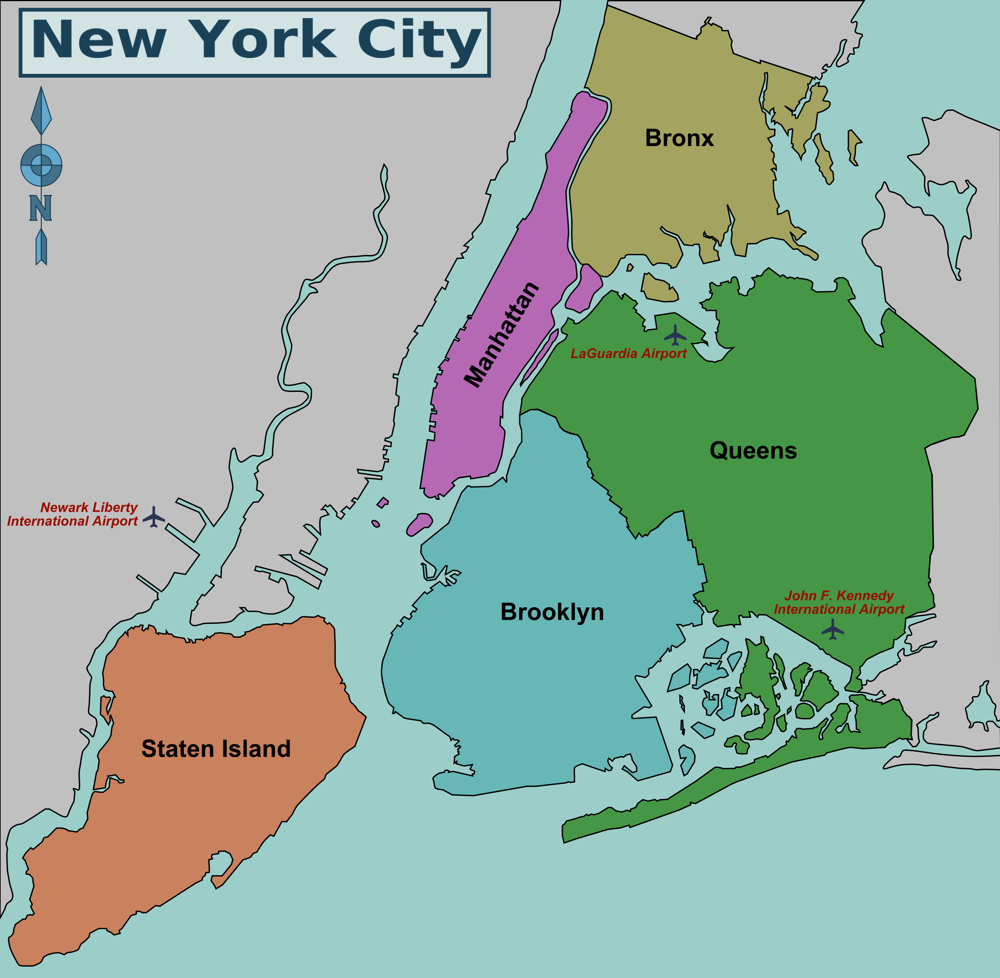

# _AirBnb_Price_pred_and_analysis_
## This project is aimed to bring out the important facts about the _New_ _York_ city airbnb details by analizing its dataset..
## It also has a predictive part which is totally dedicated to find a suitable predictive model for the company, and its future growth.
\
Source of the Dataset:- https://www.kaggle.com/dgomonov/new-york-city-airbnb-open-data

### Some of the facts that I found working on this dataset are..
1.Generally private rooms are considered in New York while renting on AirBnb, except in Manhatten where an Entire home/apt is prefered.\
2.Related to price.
  -The average price of Manhatten is more and therefore calling it the most expensive of all the neighbourhoods,\
  -Bronx is the neighbourhood group which has an average low cost properties thus considering it as the cheapest among all the 5.\
  -Staten Island can be said to have a mix of both, i,e having the rich ones and also the poor ones..\
Many kinds of analysis is presented in my Notebook, to know more facts please do go and check it out.
